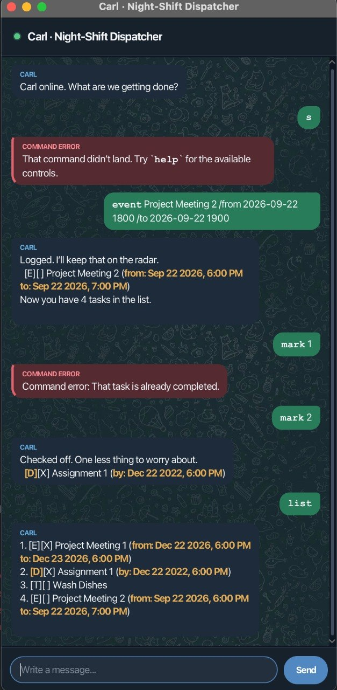

# 🟢 Carl · Night-Shift Dispatcher

> A quick, keyboard-first task manager in a Telegram-style chat.

Carl tracks todos, deadlines, and events in one local task list. Your commands appear in green on the right; Carl's replies appear in dark blue on the left, with errors highlighted in red.



[Get started](#get-started) · [Commands](#commands) · [Dates and task numbers](#dates-and-task-numbers) · [Saving](#saving-your-tasks) · [Help](#common-questions)

## Get started

### 1. Start Carl

Carl requires **Java 25**. JavaFX is already included in `carl.jar`.

1. Download `carl.jar` from the [latest GitHub release](https://github.com/Aster0/ip/releases/latest).
2. Put it in an empty folder where Carl can create `save.txt`.
3. Open a terminal in that folder and run:

   ```console
   java -jar carl.jar
   ```

> **Note:** Keep `carl.jar` and its generated `save.txt` together if you move Carl to another folder or computer.

### 2. Send a command

Click the message box, type a command, then press <kbd>Enter</kbd> or click **Send**. Start with `help` to see the commands inside Carl.

### 3. Try a short conversation

> **🟩 You**
>
> `todo buy groceries`

> **🟦 CARL**
>
> Logged. I’ll keep that on the radar.<br>
> `[T][ ] buy groceries`

> **🟩 You**
>
> `deadline submit report /by 2026-10-03 1800`

> **🟦 CARL**
>
> Logged. I’ll keep that on the radar.<br>
> `[D][ ] submit report (by: Oct 03 2026, 6:00 PM)`

## Reading the chat

| What you see | What it means |
| --- | --- |
| 🟢 Green dot beside Carl | Carl is ready |
| 🟩 Green message on the right | A command you sent |
| 🟦 Dark blue message on the left | Carl's reply |
| 🟥 Red message on the left | Something needs to be corrected |
| 🟨 Amber text | A date or time |

The window can be resized. Long messages wrap automatically, and the conversation scrolls to the latest reply.

## Commands

`<VALUE>` means the value is required. `[VALUE]` means it is optional.

| What you want to do | Command | Example |
| --- | --- | --- |
| See all commands | `help` | `help` |
| Add a todo | `todo <DESCRIPTION>` | `todo buy groceries` |
| Add a deadline | `deadline <DESCRIPTION> /by yyyy-MM-dd HHmm` | `deadline submit report /by 2026-10-03 1800` |
| Add an event | `event <DESCRIPTION> /from yyyy-MM-dd HHmm /to yyyy-MM-dd HHmm` | `event meeting /from 2026-10-04 1000 /to 2026-10-04 1130` |
| Show all tasks | `list` | `list` |
| Complete a task | `mark TASK_NUMBER` | `mark 2` |
| Reopen a task | `unmark TASK_NUMBER` | `unmark 2` |
| Delete a task | `delete TASK_NUMBER` | `delete 3` |
| Search task descriptions | `find <KEYWORD>` | `find report` |
| Show tasks for a date | `due [yyyy-MM-dd]` | `due 2026-10-04` |
| Show tasks alphabetically | `sort` | `sort` |
| Exit Carl | `bye` | `bye` |

### Useful command behaviour

- Commands are case-insensitive, so `LIST` and `list` both work.
- Extra spaces before, after, or between words are handled automatically.
- `/by`, `/from`, and `/to` must be lowercase and used only once each.
- `find` searches descriptions only. It ignores capitalisation and accepts partial matches.
- `due` without a date uses today's date. It shows deadlines due that day and events taking place that day, but not todos.
- `sort` changes only the displayed order; it does not rearrange the saved list.
- A description can contain up to 500 characters, but cannot contain `|`.

## Dates and task numbers

### Entering dates and times

Use these exact formats:

| Value | Format | Example |
| --- | --- | --- |
| Date | `yyyy-MM-dd` | `2026-10-04` |
| Date and time | `yyyy-MM-dd HHmm` | `2026-10-04 0930` |

Time uses the 24-hour clock: `0905` is 9:05 AM and `1830` is 6:30 PM. Carl rejects impossible dates such as `2026-02-30`. An event's start must be earlier than its end.

### Using task numbers safely

Run `list` before `mark`, `unmark`, or `delete`, then use the number shown in that main list.

> **Important:** `find`, `due`, and `sort` create temporary views. Their displayed numbers might not match the main list, so do not use them to choose a task to change.

Deleting a task cannot be undone. The remaining tasks receive new numbers the next time you run `list`.

### Understanding task symbols

| Symbol | Meaning |
| --- | --- |
| `[T]` | Todo |
| `[D]` | Deadline |
| `[E]` | Event |
| `[ ]` | Not completed |
| `[X]` | Completed |

For example, `[D][X] submit report` is a completed deadline.

## If a command does not work

Carl displays command and storage problems in a red message. The message explains what went wrong; correct the command and send it again.

| Problem | What to do |
| --- | --- |
| Carl does not recognise the command | Run `help` and check the command name |
| A description or date is missing | Compare your command with the example in the table above |
| A date is rejected | Use a real date in `yyyy-MM-dd`, adding `HHmm` where required |
| A task number is rejected | Run `list` and choose a positive number shown there |
| Carl says the task already exists | Use the existing task or change its details |
| Carl rejects extra words | Commands such as `list`, `sort`, `help`, and `bye` take no extra text |

Carl treats tasks with the same type and details as duplicates even if their capitalisation or completion status differs.

## Saving your tasks

Carl automatically saves after you add, complete, reopen, or delete a task. You do not need a save command or an internet connection.

Tasks are stored in `save.txt` in the folder from which Carl was started:

- If the file is missing, Carl creates it.
- If some saved lines are damaged, Carl loads the valid tasks and reports which lines it skipped.
- If Carl cannot save a change, it cancels that change instead of pretending it succeeded.

Avoid editing `save.txt` by hand. To move your tasks to another computer, close Carl and copy `save.txt` into the folder from which Carl will be started there.

## Common questions

### Why does Carl say “Radar clear”?

There are no tasks to show. With `find` or `due`, tasks may exist but none match your search.

### Why did `mark 1` change a different task from the first search result?

Task-changing commands always use the main list's numbering. Run `list`, then use the number shown there.

### Why does the window not open?

Run `java -version` and confirm that Java 25 is selected. Then start Carl from a terminal using `java -jar carl.jar` so that any launch error is visible.

### Does Carl work on macOS and Windows?

Yes. The released fat JAR includes JavaFX components for macOS, Windows, and Linux. Each computer still needs Java 25.

### Can I recover a deleted task?

No. Carl has no undo command, so run `list` and check the task number before deleting.

### How do I build Carl from source?

Open a terminal in the project folder and use Java 25. Run `./gradlew shadowJar` on macOS or Linux, or `gradlew.bat shadowJar` on Windows. The result is `build/libs/carl.jar`.

---

🟢 **Carl online. What are we getting done?**
